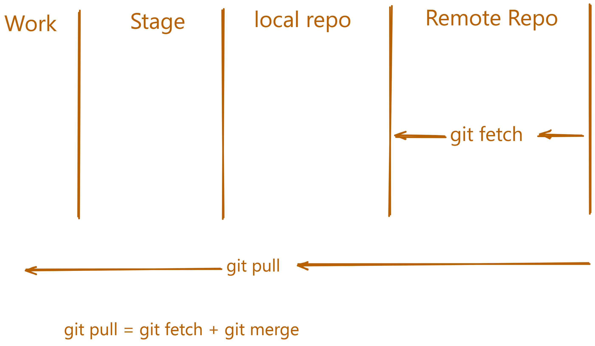

# General Git Commands for Version Control

---

# Table of Contents

1. [Basic Commands](#basic-commands)
2. [Branching and Merging](#branching-and-merging)
3. [Remote Repositories](#remote-repositories)
4. [Undoing Changes](#undoing-changes)
5. [Working with Tags](#working-with-tags)
6. [Stashing Changes](#stashing-changes)
7. [Configuration and Settings](#configuration-and-settings)
8. [Git Aliases](#git-aliases)
9. [Diff Stash and Tags](#diff-stash-and-tags)
10. [Git Rebase and Reflog Guide
    ](#git-rebase-and-reflog-guide)
11. [SSH Key Setup for GitHub](#ssh-key-setup-for-github)

---

# General Git Commands for Version Control

---

## **Basic Commands**

1. **`git init`**  
   **Definition:** Initializes a new Git repository in the current directory. It creates a `.git` directory, which will store all the necessary metadata for version control.  
   **Example:** `git init`

2. **`git clone`**  
   **Definition:** Clones an existing remote repository to your local machine. It copies all files, branches, and commits.  
   **Example:** `git clone https://github.com/username/repository.git`

3. **`git status`**  
   **Definition:** Displays the current state of the repository, including changes to files (modified, added, etc.), staging status, and the current branch.  
   **Example:** `git status`

4. **`git add`**  
   **Definition:** Stages changes (new, modified, or deleted files) to be included in the next commit.  
   **Example:** `git add .` (stages all changes)  
   **Example:** `git add file.txt`

5. **`git commit`**  
   **Definition:** Commits the staged changes to the local repository, recording them as a snapshot with a descriptive message.  
   **Example:** `git commit -m "Initial commit"`

6. **`git push`**  
   **Definition:** Pushes local commits to a remote repository, syncing your local branch with the remote one.  
   **Example:** `git push origin main`

## Get code from remote repository

There are two ways to get code from a remote repository:

- fetch the code
- pull the code

Fetch the code means that you are going to download the code from the remote repository to your local repository. Pull the code means that you are going to download the code from the remote repository and merge it with your local repository.



### Fetch code

To fetch code from a remote repository, you can use the following command:

```bash
git fetch <remote-name>
```

7.  **`git fetch`**  
    **Definition:** Fetches changes from a remote repository but does not merge them into your local branch.  
    **Example:** `git fetch`

### Pull code

To pull code from a remote repository, you can use the following command:

```bash
# git pull <remote-name> <branch-name>
git pull origin main
```

Here <remote-name> is the name of the remote repository that you want to pull from and <branch-name> is the name of the branch that you want to pull.

8. **`git pull`**  
   **Definition:** Fetches and merges changes from a remote repository into your local branch.  
   **Example:** `git pull origin main`

9. **`git merge`**  
   **Definition:** Merges a branch (or changes) into the current branch. This command can cause conflicts if there are discrepancies between the two branches.  
   **Example:** `git merge feature-branch`

10. **`git log`**  
    **Definition:** Displays a list of commits on the current branch, along with details such as commit messages, authors, and dates.  
    **Example:** `git log`

---

## **Branching and Merging**

11. **`git branch`**  
    **Definition:** Lists all local branches or creates a new branch.  
    **Example:** `git branch` (lists branches)  
    **Example:** `git branch new-branch` (creates a new branch)

12. **`git checkout`**  
    **Definition:** Switches between branches or restores files to a previous state.  
    **Example:** `git checkout main`  
    **Example:** `git checkout -b new-branch` (creates and switches to `new-branch`)

13. **`git branch -d`**  
    **Definition:** Deletes a local branch that has already been merged.  
    **Example:** `git branch -d old-branch`

14. **`git merge --no-ff`**  
    **Definition:** Merges a branch into the current branch, forcing a merge commit even if a fast-forward merge is possible.  
    **Example:** `git merge --no-ff feature-branch`

15. **`git switch <branch-name>`**  
    **Definition:** Switches to the specified branch. This command is a more intuitive alternative to `git checkout` for switching branches.  
    **Example:** `git switch bug-fix`

16. **`git log`**  
    **Definition:** Shows the commit history for the current branch.  
    **Example:** `git log`

17. **`git switch master`**  
    **Definition:** Switches to the `master` branch.  
    **Example:** `git switch master`

18. **`git switch -c <branch-name>`**  
    **Definition:** Creates a new branch and switches to it immediately. The `-c` flag is used to create a new branch.  
    **Example:** `git switch -c dark-mode`

19. **`git checkout <branch-name>`**  
    **Definition:** Switches to a specific branch.  
    **Example:** `git checkout orange-mode`

20. **`git checkout <commit-id> -- <file-path>`**  
    **Definition:** Checks out a file from a specific commit.  
    **Example:** `git checkout abc1234 -- README.md`

21. **`git checkout <branch-name> -- <file-path>`**  
    **Definition:** Checks out a specific file from a different branch.  
    **Example:** `git checkout main -- README.md`

22. **`git checkout -- <file-path>`**  
    **Definition:** Restores a file to its last committed state, discarding local changes.  
    **Example:** `git checkout -- README.md`

23. **`git restore --source <branch-or-commit> <file-path>`**  
    **Definition:** Restores a file from a specific branch or commit.  
    **Example:** `git restore --source main README.md`

24. **`git restore <file-path>`**  
    **Definition:** Discards local changes and restores the file to the last committed state.  
    **Example:** `git restore README.md`

25. **`git branch -m <new-branch-name>`**  
    **Definition:** Renames the current branch or a specified branch. The `-m` flag is used to rename the branch.  
    **Example:** `git branch -m new-branch-name` (renames the current branch to `new-branch-name`)  
    **Example:** `git branch -m old-branch-name new-branch-name` (renames `old-branch-name` to `new-branch-name`)

---

## **Diff Stash and Tags**

### **Git Diff Commands**

1. **`git diff`**  
   **Definition:** Shows the unstaged changes in your working directory compared to the staging area. This command alone will not show you the changes made in the files, such as `A` and `B`; options are needed to view the changes.  
   **Example:** `git diff` (shows the unstaged changes in the working directory)

   ***

2. **`git diff --staged`**  
   **Definition:** Shows the changes between your last commit and the staging area (i.e., changes that are staged and ready to be committed).  
   **Example:** `git diff --staged` (shows the changes staged for commit)

   ***

3. **`git diff <branch-name-one> <branch-name-two>`**  
   **Definition:** Compares the differences between two branches.  
   **Example:** `git diff branch-one branch-two` (compares the differences between `branch-one` and `branch-two`)

   ***

4. **`git diff branch-name-one..branch-name-two`**  
   **Definition:** Another way to compare the differences between two branches.  
   **Example:** `git diff branch-one..branch-two` (compares the differences between `branch-one` and `branch-two`)

   ***

5. **`git diff <commit-hash-one> <commit-hash-two>`**  
   **Definition:** Compares the differences between two commits.  
   **Example:** `git diff abc1234 def5678` (compares the differences between commit `abc1234` and commit `def5678`)

### **Git Stash Commands**

1. **`git stash`**  
   **Definition:** Saves your changes in a temporary location. This is useful when you want to switch branches or perform other tasks but don’t want to commit your changes yet. The stash acts like a stack of changes that you can access and apply later.  
   **Example:** `git stash` (saves the current changes to the stash)

---

2. **`git stash save "message"`**  
   **Definition:** Saves your changes in the stash with a custom name/message to help you remember the purpose of the stash.  
   **Example:** `git stash save "work in progress on X feature"` (saves the changes with the message "work in progress on X feature")

---

3. **`git stash list`**  
   **Definition:** Displays the list of all stashes saved in the repository.  
   **Example:** `git stash list` (shows all stashes with their indices and messages)

---

4. **`git stash apply`**  
   **Definition:** Applies the most recent stash to your working directory without removing it from the stash list.  
   **Example:** `git stash apply` (applies the most recent stash)

---

5. **`git stash apply stash@{n}`**  
   **Definition:** Applies a specific stash, where `n` is the index of the stash in the list.  
   **Example:** `git stash apply stash@{0}` (applies the first stash in the list)

---

6. **`git stash pop`**  
   **Definition:** Applies the most recent stash and removes it from the stash list.  
   **Example:** `git stash pop` (applies and removes the most recent stash)

---

7. **`git stash drop`**  
   **Definition:** Removes a specific stash from the stash list without applying it.  
   **Example:** `git stash drop` (drops the most recent stash)  
   **Example:** `git stash drop stash@{0}` (drops the specific stash at index 0)

---

8. **`git stash apply stash@{n} <branch-name>`**  
   **Definition:** Applies a specific stash to a specific branch.  
   **Example:** `git stash apply stash@{0} feature-branch` (applies the stash at index 0 to the `feature-branch`)

---

9. **`git stash clear`**  
   **Definition:** Clears all stashes from the stash list.  
   **Example:** `git stash clear` (removes all stashes from the stash list)

   ## Git Tagging

1. `git tag -a <tag-name> -m "message"` - Create an annotated tag with a message
   Example: `git tag -a v1.0 -m "Release 1.0"`
1. `git tag` - List all tags in the repository

   - Example: `git tag`

1. `git tag <tag-name> <commit-hash>` - Tag a specific commit

   Example: `git tag v1.0 abc1234`

1. `git push origin <tag-name>` - Push a tag to the remote repository

   Example: `git push origin v1.0`

1. `git tag -d <tag-name>` - Delete a local tag

   Example: `git tag -d v1.0`

1. `git push origin :<tag-name>` - Delete a tag on the remote repository

   Example: `git push origin :v1.0`

---

# Git Rebase and Reflog Guide

## Rebase a Feature Branch

### Ensure you are on the branch you want to rebase

```bash
git checkout feature-branch
git rebase main
```

This will replay the commits from `feature-branch` on top of the latest changes in `main`.

## Resolve Conflicts During Rebase

If there are any conflicts, you will need to resolve them manually.

Use the merge tool in VSCode or edit the files directly.

Then stage the resolved files:

```bash
git add <resolved-files>
git rebase --continue
```

⚠️ **Avoid using `--force` when rebasing.** It can cause serious issues with the project's history. Many have horror stories of breaking their project with a careless `--force`.

---

## Git Reflog

Git reflog tracks the history of your commits, including those that may no longer appear in the regular commit log. This is helpful for recovering lost work.

### View Reflog

```bash
git reflog
```

Shows the history of HEAD movements and other actions.

### Find a Specific Commit

```bash
git reflog <commit-hash>
```

Use this to inspect the state of the repository at a specific commit.

### Recover Lost Commits or Changes

If you've accidentally deleted a branch or made destructive changes, you can often recover with reflog:

```bash
git reflog
# Find the commit

git reset --hard <commit-hash>
```

Or use the relative index notation:

```bash
git reset --hard HEAD@{1}
```

This resets to the state of the repository at a previous point in time.

---

📌 **Tip:** Always double-check before performing destructive operations like `reset --hard`. You can always create a temporary branch at your current HEAD just in case:

```bash
git branch temp-backup
```

Stay safe and keep your commit history clean!

---

## **Remote Repositories**

15. **`git remote`**  
    **Definition:** Shows the remote repositories associated with your project.  
    **Example:** `git remote -v`

16. **`git remote add`**  
    **Definition:** Adds a remote repository to your project.  
    **Example:** `git remote add origin https://github.com/username/repository.git`

17. **`git remote remove`**  
    **Definition:** Removes a remote repository from your project.  
    **Example:** `git remote remove origin`

### Setup an upstream remote

Setting up an upstream remote is useful when you want to keep your local repository up to date with the remote repository. It allows you to fetch and merge changes from the remote repository into your local repository.

### To set up an upstream remote, you can use the following command:

or you can use shorthand:

```
git remote add -u <remote-url>
```

**Example**

```git push -u origin main

```

18. **`git push --set-upstream`**  
    **Definition:** Sets the upstream branch for your current branch, so subsequent pushes go to that branch by default.  
    we can also use **`git push -u `**

    **Example:** `git push --set-upstream origin main`

---

## **Undoing Changes**

19. **`git restore`**  
    **Definition:** Restores a file to its last committed state, discarding any local changes.  
    **Example:** `git restore file.txt`

20. **`git reset`**  
    **Definition:** Unstages changes or resets the commit history. It can be used with different options for different behaviors.  
    **Example:** `git reset HEAD file.txt` (unstages the file)  
    **Example:** `git reset --hard` (resets everything to the last commit)

21. **`git revert`**  
    **Definition:** Creates a new commit that undoes changes made by a previous commit, preserving history.  
    **Example:** `git revert <commit-hash>`

22. **`git rm`**  
    **Definition:** Removes a file from the working directory and stages its deletion.  
    **Example:** `git rm file.txt`

---

## **Working with Tags**

23. **`git tag`**  
    **Definition:** Lists all tags in the repository. Tags are often used to mark releases or significant milestones in the project.  
    **Example:** `git tag`

24. **`git tag <tag-name>`**  
    **Definition:** Creates a new tag in the repository at the current commit.  
    **Example:** `git tag v1.0`

25. **`git push origin --tags`**  
    **Definition:** Pushes all tags to the remote repository.  
    **Example:** `git push origin --tags`

26. **`git tag -d <tag-name>`**  
    **Definition:** Deletes a tag locally.  
    **Example:** `git tag -d v1.0`

---

## **Stashing Changes**

27. **`git stash`**  
    **Definition:** Temporarily saves changes (that are not ready to commit) so you can work on something else.  
    **Example:** `git stash`

28. **`git stash apply`**  
    **Definition:** Applies the most recent stash, restoring the saved changes.  
    **Example:** `git stash apply`

29. **`git stash pop`**  
    **Definition:** Applies the most recent stash and removes it from the stash list.  
    **Example:** `git stash pop`

---

## **Configuration and Settings**

30. **`git config`**  
    **Definition:** Configures user information for Git, such as name and email.  
    **Example:** `git config --global user.name "Your Name"`  
    **Example:** `git config --global user.email "youremail@example.com"`

31. **`git config --list`**  
    **Definition:** Lists all Git configuration settings.  
    **Example:** `git config --list`

---

---

### SSH Key Setup for GitHub

# 🔐 SSH Key Setup for GitHub

Setting up an SSH key allows you to securely connect to GitHub without entering your username and password each time.

---

## 📌 `ssh-keygen`

**Definition:** Generates a new SSH key.

**Process:**

# SSH Key Generation Guide

This guide explains how to generate a new SSH key pair using the `ed25519` algorithm.

## Step 1: Open Your Terminal

First, open your terminal (Command Prompt, PowerShell, or any terminal on Linux/macOS).

## Step 2: Run the Command

To generate an SSH key pair, use the following command:

```bash
ssh-keygen -t ed25519 -C "your-email@chaicode.com"
```

### Breakdown of the Command:

---

`ssh-keygen`: This is the command-line tool to generate SSH keys.

`-t ed25519`: Specifies the type of key to generate. ed25519 is a modern and highly secure elliptic curve algorithm for SSH keys. It's preferred over older algorithms like RSA because it offers better security with smaller key sizes and faster performance.

`-C "your-email@chaicode.com"`: This flag adds a comment to the key, often used to identify it. The comment `"your-email@chaicode.com"` can be replaced with your own email address or any other description you'd like to associate with the key.

## Step 3: Follow the Prompts

After running the command, you will be prompted with the following:

1. Enter file in which to save the key:

- By default, the key is saved in the ~/.ssh/ directory. You can press Enter to accept the default location, or you can specify a different path.

2. Enter passphrase (optional):

- You will be prompted to enter a passphrase for the key. This adds an extra layer of security. You can either enter a passphrase or press Enter to skip this step.

## Step 4: View Your SSH Key Pair

After the process completes, you should see output similar to this:

```bash
Your identification has been saved in /home/username/.ssh/id_ed25519.
Your public key has been saved in /home/username/.ssh/id_ed25519.pub.
```

- The private key is saved in ~/.ssh/id_ed25519 (or the custom location you specified).

- The public key is saved in ~/.ssh/id_ed25519.pub.

The public key is the one you will share with remote servers, while the private key stays secure on your local machine.

## Step 5: Add the SSH Key to SSH Agent (Optional)

If you want to use the SSH key automatically without entering the passphrase each time, you can add the private key to your SSH agent:

```bash
eval "$(ssh-agent -s)"
ssh-add ~/.ssh/id_ed25519
```

## **Example for SSH**

# 🔐 SSH Key Setup for GitHub

Setting up an SSH key allows you to securely connect to GitHub without entering your username and password each time.

---

## you can open it on different tab using this link

# Git Setup Documentation

To learn how to set up SSH for Git, refer to the [GitHub SSH Setup Documentation](./github-ssh-setup.md).

## 📌 `ssh-keygen`

**Definition:** Generates a new SSH key.

**Example:**

```bash
ssh-keygen -t ed25519 -C "your-email@chaicode.com"
```

- `-t ed25519`: Specifies the key type (recommended).

- `-C`: A comment label, usually your email address.

# 💾 Saving the Key

After running the above command, you'll see a prompt:

```bash
Enter a file in which to save the key (/Users/YOU/.ssh/id_ed25519): [Press enter]
```

- Press Enter to accept the default location.

- When prompted, optionally enter a passphrase or press Enter to skip.

# ⚙️ ssh-agent

Definition: A program that keeps your private key in memory for secure access.

macOS / Linux:

```bash
eval "$(ssh-agent -s)"
```

Windows (Git Bash):

```bash
eval $(ssh-agent -s)
```

Add your private key:

```bash
ssh-add ~/.ssh/id_ed25519
```

# 💡 macOS only: Add your SSH key to the keychain:

```bash
ssh-add --apple-use-keychain ~/.ssh/id_ed25519
```

---

# 📋 Copy Public Key to Clipboard

macOS:

```bash
pbcopy < ~/.ssh/id_ed25519.pub
```

Windows (Git Bash):

```bash
clip < ~/.ssh/id_ed25519.pub
```

Linux:

```bash
xclip -sel clip < ~/.ssh/id_ed25519.pub
```

---

# ➕ Add SSH Key to GitHub

- Go to: GitHub → Settings → SSH and GPG Keys

- Click "New SSH Key"

- Add a title (e.g., My Personal Laptop) and paste the copied public key

- Click "Add SSH key"

[👉 More info: GitHub Docs – Add a new SSH key](https://docs.github.com/en/github/authenticating-to-github/adding-a-new-ssh-key-to-your-github-account)

---

# ✅ Test the SSH Connection

`Run`:

```bash
ssh -T git@github.com
```

`Expected output:`

```bash
Hi username! You've successfully authenticated, but GitHub does not provide shell access.
```

# 📚 References

[GitHub Docs – Connecting to GitHub with SSH](https://docs.github.com/en/github/authenticating-to-github/connecting-to-github-with-ssh)

[GitHub Docs – Adding a new SSH key](https://docs.github.com/en/github/authenticating-to-github/adding-a-new-ssh-key-to-your-github-account)

## **Git Aliases**

32. **`git config --global alias.<alias-name> "<command>"`**  
    **Definition:** Creates a shortcut (alias) for a Git command.  
    **Example:** `git config --global alias.co "checkout"` (so `git co` is a shortcut for `git checkout`)
33. **`git config --get-regexp alias`**  
     **Definition:** Show all configured Git aliases.
    **Example:** `git config --global alias.aliases 'config --get-regexp alias'
(so `git aliases`is a shortcut for`git get all aliasses`)

---

### How to Save:

1. Copy the above content.
2. Open **VSCode** and create a new file.
3. Paste the content into the file.
4. **Save** the file as `Git_Commands.md` or any name you'd prefer.

---
